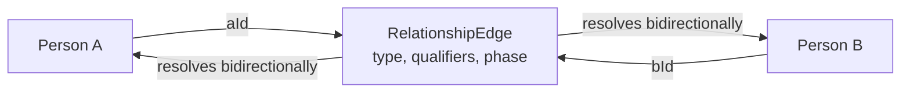
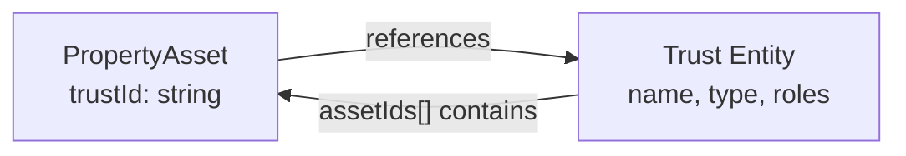
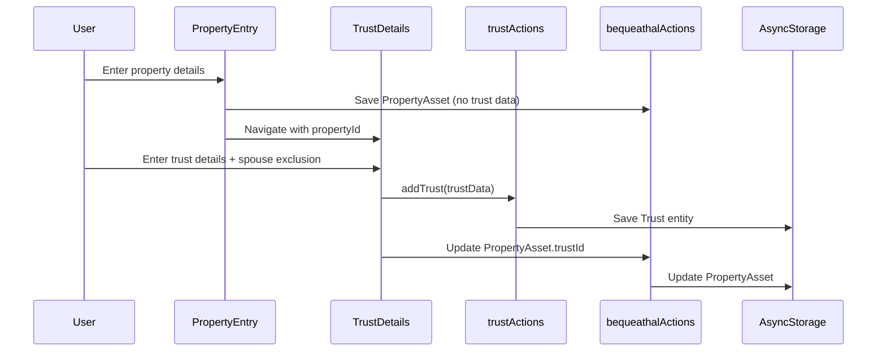
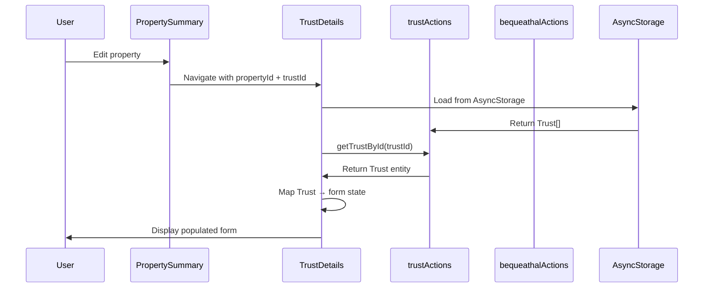
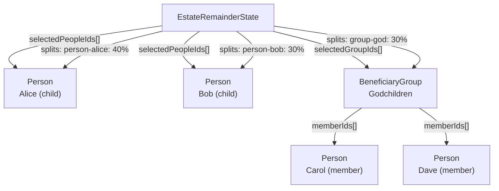

# Entity Relationship Diagram (ERD)

**Generated:** January 12, 2026  
**Last Updated:** January 12, 2026 (Multi-User + Bequest Separation)  
**Purpose:** Complete data model visualization for Kindling estate planning app  
**Storage:** AsyncStorage (local-only, offline-first)  
**Backend:** Rails/PostgreSQL ready with proper foreign keys

---

## Core Entity Overview

The Kindling app uses 11 core entities with normalized relationships:

1. **Person** - People in the system (will-maker, executors, beneficiaries, family)
2. **WillData** - Main will document (versioned)
3. **Bequest** - Disposition instructions (who gets what)
4. **Trust** - Trust structures for estate planning
5. **Business** - Companies and organizations
6. **BeneficiaryGroup** - Groups of beneficiaries for estate remainder
7. **RelationshipEdge** - Normalized relationship graph between people
8. **EstateRemainderState** - Residual estate allocation
9. **Assets** (10 subtypes) - All types of property and holdings
10. **BequeathalData** - Container organizing assets by category
11. **IHTDrawerState** - UI state for tax calculator

---

## Complete ERD (With Ownership)

```mermaid
erDiagram
    Person ||--|| WillData : "owns via userId"
    Person ||--o{ WillData : "executor in"
    Person ||--o{ WillData : "guardian in"
    Person ||--o{ Person : "has relationship"
    Person ||--o{ Trust : "owns via userId"
    Person ||--o{ Trust : "settlor beneficiaries"
    Person ||--o{ Trust : "trustees"
    Person ||--o{ Business : "owns via userId"
    Person ||--o{ BeneficiaryGroup : "member of"
    Person ||--o{ BeneficiaryGroup : "owns via willId"
    Person ||--o{ RelationshipEdge : "participates in"
    Person ||--o{ EstateRemainderState : "owns via userId"
    Person ||--o{ EstateRemainderState : "selected for estate"
    Person ||--o{ PropertyAsset : "owns via userId"
    Person ||--o{ Bequest : "beneficiary in"
    
    WillData ||--o{ Bequest : "contains via bequestIds"
    WillData ||--o{ GuardianHierarchy : "defines for child"
    WillData ||--o{ AlignmentInfo : "spouse alignment"
    
    Bequest ||--|| Asset : "disposes via assetId"
    
    Trust ||--o{ Asset : "holds via assetIds"
    
    Business ||--o{ AssetsHeldThroughBusinessAsset : "owns via businessId"
    
    BeneficiaryGroup ||--o{ EstateRemainderState : "in allocation"
    
    BequeathalData ||--o{ PropertyAsset : "organizes"
    BequeathalData ||--o{ ImportantItemAsset : "organizes"
    BequeathalData ||--o{ InvestmentAsset : "organizes"
    BequeathalData ||--o{ PensionAsset : "organizes"
    BequeathalData ||--o{ LifeInsuranceAsset : "organizes"
    BequeathalData ||--o{ BankAccountAsset : "organizes"
    BequeathalData ||--o{ PrivateCompanySharesAsset : "organizes"
    BequeathalData ||--o{ AssetsHeldThroughBusinessAsset : "organizes"
    BequeathalData ||--o{ AgriculturalAsset : "organizes"
    BequeathalData ||--o{ CryptoCurrencyAsset : "organizes"

    Person {
        string id PK
        string firstName
        string lastName
        string email
        string phone
        PersonRole[] roles
        string relationship
        string dateOfBirth
        AddressData address
        boolean isDependent
        boolean isUnder18
        boolean inCare
        CareCategory careCategory
        string[] guardianIds FK
        ExecutorRole executorRole
        string executorStatus
        boolean createdInOnboarding
        Date createdAt
        Date updatedAt
    }
    
    WillData {
        string userId FK "Person.id"
        string willType
        string status
        Executor[] executors "Person IDs"
        object guardianship "childId to guardians"
        object alignment "childId to AlignmentInfo"
        Date createdAt
        Date updatedAt
    }
    
    Trust {
        string id PK
        string name
        TrustType type
        string creationMonth
        string creationYear
        Date creationDate
        boolean isUserSettlor
        boolean isUserBeneficiary
        boolean isUserTrustee
        object settlor "beneficiaries, trustees"
        object beneficiary "entitlement, spouse exclusion"
        object trustee "duties, co-trustees"
        string[] assetIds FK "Asset IDs"
        string createdInContext
        Date createdAt
        Date updatedAt
    }
    
    Business {
        string id PK
        string name
        string businessType
        string registrationNumber
        number ownershipPercentage
        number estimatedValue
        string description
        AddressData address
        Date createdAt
        Date updatedAt
    }
    
    BeneficiaryGroup {
        string id PK
        string name
        string description
        boolean isPredefined
        boolean isActive
        string[] memberIds FK "Person IDs"
        string willId FK "Person.id"
        Date createdAt
        Date updatedAt
    }
    
    RelationshipEdge {
        string id PK
        string aId FK "Person.id"
        string bId FK "Person.id"
        RelationshipType type
        PartnershipPhase phase
        object qualifiers
        Date startedAt
        Date endedAt
        object metadata
        Date createdAt
        Date updatedAt
    }
    
    EstateRemainderState {
        string[] selectedPeopleIds FK "Person IDs"
        string[] selectedGroupIds FK "BeneficiaryGroup IDs"
        object splits "percentage allocations"
        object lockedCards "lock status"
        Date lastUpdated
    }
    
    PropertyAsset {
        string id PK
        string type "property"
        string title
        AddressData address
        string propertyType
        string ownershipType
        number ownershipPercentage
        boolean primaryResidence
        boolean hasLivedThere
        boolean hasMortgage
        object mortgage
        object beneficiaryAssignments
        string trustId FK "Trust.id"
        number estimatedValue
        number netValue
        Date createdAt
        Date updatedAt
    }
    
    ImportantItemAsset {
        string id PK
        string type "important-items"
        string title
        string category
        string specificDetails
        boolean sentimentalValue
        object beneficiaryAssignments
        number estimatedValue
        Date createdAt
        Date updatedAt
    }
    
    InvestmentAsset {
        string id PK
        string type "investment"
        string title
        string investmentType
        string provider
        string accountNumber
        number estimatedValue
        Date createdAt
        Date updatedAt
    }
    
    PensionAsset {
        string id PK
        string type "pensions"
        string title
        string provider
        string policyNumber
        string linkedEmployer
        string pensionType
        number monthlyContribution
        number employerContribution
        string pensionOwner
        string customOwner
        string beneficiaryNominated
        number estimatedValue
        Date createdAt
        Date updatedAt
    }
    
    LifeInsuranceAsset {
        string id PK
        string type "life-insurance"
        string title
        string policyType
        string provider
        string policyNumber
        string lifeAssured
        number sumInsured
        number monthlyPremium
        string beneficiaryKnown
        string premiumStatus
        object[] beneficiaries
        number estimatedValue
        Date createdAt
        Date updatedAt
    }
    
    BankAccountAsset {
        string id PK
        string type "bank-accounts"
        string title
        string accountType
        string provider
        string accountNumber
        string sortCode
        string ownershipType
        boolean isNonUkBank
        number estimatedValue
        Date createdAt
        Date updatedAt
    }
    
    PrivateCompanySharesAsset {
        string id PK
        string type "private-company-shares"
        string title
        string companyName
        number numberOfShares
        string shareClass
        number totalValue
        number costBasis
        boolean isActivelyTrading
        boolean heldForTwoPlusYears
        boolean doesNotDealInRestrictedAssets
        boolean isNotHoldingCompany
        Date createdAt
        Date updatedAt
    }
    
    AssetsHeldThroughBusinessAsset {
        string id PK
        string type "assets-held-through-business"
        string title
        string businessId FK "Business.id"
        string businessName
        string businessType
        string assetType
        string assetDescription
        number businessOwnershipPercentage
        number numberOfUnits
        boolean excludeFromBusinessValuation
        number estimatedValue
        Date createdAt
        Date updatedAt
    }
    
    AgriculturalAsset {
        string id PK
        string type "agricultural-assets"
        string title
        string assetType
        string assetDescription
        string location
        string ownershipStructure
        string customOwnershipStructure
        string sizeQuantity
        number yearsOwned
        string activeAgriculturalUse
        string hasDebtsEncumbrances
        number debtAmount
        string debtDescription
        string farmWorkerOccupied
        string woodlandPurpose
        string studFarmActivity
        string otherAssetTypeDetail
        string aprOwnershipDuration
        string aprOwnershipStructure
        string aprTrustType
        string bprActiveTrading
        string bprOwnershipDuration
        string notes
        number estimatedValue
        Date createdAt
        Date updatedAt
    }
    
    CryptoCurrencyAsset {
        string id PK
        string type "crypto-currency"
        string title
        string cryptoType
        string platform
        number quantity
        number estimatedValue
        Date createdAt
        Date updatedAt
    }
    
    BequeathalData {
        Asset[] property
        Asset[] important-items
        Asset[] investment
        Asset[] pensions
        Asset[] life-insurance
        Asset[] bank-accounts
        Asset[] private-company-shares
        Asset[] assets-held-through-business
        Asset[] debts-credit
        Asset[] agricultural-assets
        Asset[] crypto-currency
        Asset[] other
        Set selectedCategories
        number totalEstimatedValue
        number totalNetValue
        Date lastUpdated
    }
    
    GuardianHierarchy {
        object[] guardians "Person ID and level"
    }
    
    AlignmentInfo {
        string alignedUser FK "Person.id"
        AlignmentStatus status
    }
    
    TrustBeneficiary {
        string id FK "Person.id or BeneficiaryGroup.id"
        string type
        number percentage
        boolean isManuallyEdited
    }
```



---

## Entity Details

### 1. Person Entity

**Primary Entity** for all individuals in the system.

**Key Features:**
- Multi-role support (can be will-maker, executor, beneficiary, guardian simultaneously)
- Referenced by nearly every other entity
- Stores contact info, demographics, care status
- Links to guardians via `guardianIds[]`

**Relationships:**
- `1:1` with WillData (as will-maker via `WillData.userId`)
- `1:N` with WillData (as executor via `WillData.executors[]`)
- `1:N` with WillData (as guardian via `WillData.guardianship`)
- `M:N` with Person (via RelationshipEdge)
- `1:N` with BeneficiaryGroup (as member via `BeneficiaryGroup.memberIds[]`)
- `1:N` with Trust (as trustee via `Trust.settlor.trusteeIds[]`)
- `1:N` with Trust (as beneficiary via `Trust.settlor.beneficiaries[]`)
- `1:N` with EstateRemainderState (via `selectedPeopleIds[]`)

**Storage Key:** `kindling-person-data`

---

### 2. WillData Entity

**Central document** linking will-maker to executors and guardianship configuration.

**Key Features:**
- Single will per will-maker (userId)
- Executor hierarchy (levels 1-4)
- Guardianship configuration per child
- Spouse alignment tracking

**Relationships:**
- `N:1` with Person (userId → will-maker)
- `1:N` with Person (executors[] → Person IDs)
- `1:N` with Person (guardianship object → guardian Person IDs per child)

**Storage Key:** `kindling-will-data`

---

### 3. Bequest Entity

**Disposition instructions** separating asset ownership from will instructions.

**Key Features:**
- Links assets to will versions (who gets what)
- Supports multiple will versions with different dispositions for same asset
- Asset data (ownership facts) remain unchanged when beneficiaries change
- Enables will versioning without asset duplication

**Architecture Principle:**
- **Assets** = What you own (facts, stable)
- **Bequests** = Who gets what (instructions, versioned)

**Relationships:**
- `N:1` with WillData (willId → WillData.id)
- `N:1` with Asset (assetId → Asset.id, any type)
- `1:N` with Person (beneficiaries[] → Person IDs)
- `1:N` with BeneficiaryGroup (beneficiaries[] → Group IDs)

**Storage Key:** `kindling-bequests`

**Example Use Case:**
```
Asset: 123 Main Street (owned by User A)
- Will v1 (2023): Bequest → Alice 100%
- Will v2 (2024): Bequest → Alice 50%, Bob 50%
- Will v3 (2025): Bequest → Bob 100%

Asset unchanged (same property, same owner)
Bequests track disposition changes over time
```

---

### 4. Trust Entity

**Normalized trust structure** replacing inline trust fields.

**Key Features:**
- **userId** - Links to will-maker (multi-user ready)
- Single source of truth for trust data
- Multi-role support (settlor, beneficiary, trustee)
- `isUserSettlor` means "the user (userId) is settlor of this trust"
- Links to multiple assets via `assetIds[]`
- Conditional data objects (settlor, beneficiary, trustee)

**Relationships:**
- `N:1` with Person (userId → Person.id - OWNER)
- `1:N` with Assets (assetIds[] → Asset IDs)
- `N:1` with PropertyAsset (PropertyAsset.trustId → Trust.id)
- `1:N` with Person (settlor.trusteeIds[] → Person IDs)
- `1:N` with TrustBeneficiary (settlor.beneficiaries[] → Person/Group IDs)

**Storage Key:** `kindling-trusts`

**New Fields:** 
- `userId` (ownership tracking)
- `beneficiary.spouseExcludedFromBenefit` (settlor+beneficiary roles only)

---

### 5. Business Entity

**Company/organization structure** for business asset linkage.

**Key Features:**
- **userId** - Links to will-maker (multi-user ready)
- References by AssetsHeldThroughBusinessAsset
- Stores ownership percentage, valuation
- Optional registration details

**Relationships:**
- `N:1` with Person (userId → Person.id - OWNER)
- `1:N` with AssetsHeldThroughBusinessAsset (via `businessId`)

**Storage Key:** `kindling-business-data`

---

### 6. BeneficiaryGroup Entity

**Grouping mechanism** for estate remainder allocation.

**Key Features:**
- **willId** - Links to will-maker Person ID (ownership)
- Predefined templates (Children, Siblings) or custom user-created
- Soft deletion via `isActive` flag
- Links to Person entities via `memberIds[]`

**Relationships:**
- `1:N` with Person (memberIds[] → Person IDs)
- `N:1` with Person (willId → will-maker Person ID - OWNER)
- `1:N` with EstateRemainderState (via `selectedGroupIds[]`)

**Storage Key:** `kindling-beneficiary-groups`

---

### 7. RelationshipEdge Entity

**Normalized relationship graph** between people.

**Key Features:**
- Single edge per relationship (no duplicates)
- Symmetric (spouse, partner, sibling) or directed (parent-of)
- Optional qualifiers (biological, adoptive, step)
- Partnership phases (active, separated, divorced, widowed)
- **No userId** - Relationships exist independently (shared across user contexts)

**Relationships:**
- `N:1` with Person (aId → Person.id)
- `N:1` with Person (bId → Person.id)

**Storage Key:** `kindling-relationships`

**Graph Structure:**


---

### 8. EstateRemainderState Entity

**Residual estate allocation** after specific gifts.

**Key Features:**
- **userId** - Links to will-maker (one per user)
- References Person and BeneficiaryGroup entities
- Percentage splits with lock states
- Slider-based allocation UI

**Relationships:**
- `N:1` with Person (userId → Person.id - OWNER)
- `1:N` with Person (selectedPeopleIds[] → Person IDs)
- `1:N` with BeneficiaryGroup (selectedGroupIds[] → BeneficiaryGroup IDs)

**Storage Key:** `kindling-estate-remainder`

---

### 9. Asset Entities (10 Types)

All assets extend `BaseAsset` and are stored in `BequeathalData` by category.

**Key Multi-User Feature:**
- All assets inherit **userId** from BaseAsset (links to will-maker)
- Auto-populated when creating assets via `bequeathalActions.addAsset()`
- Enables proper data scoping in multi-user Rails backend

#### 9.1 PropertyAsset

**Real estate holdings.**

**Key Features:**
- **userId** - Links to will-maker (inherits from BaseAsset)
- Address, ownership type, mortgage
- Primary residence tracking
- Foreign key to Trust entity (`trustId`) for trust-held properties
- **Beneficiary data moved to Bequest entity** (separation of concerns)

**Relationships:**
- `N:1` with Person (userId → Person.id - OWNER)
- `N:1` with Trust (trustId → Trust.id)
- `1:N` with Bequest (via assetId - who gets this in each will version)

**Trust Flow:**


#### 9.2 ImportantItemAsset

**Jewelry, artwork, collectibles.**

**Key Features:**
- **userId** - Links to will-maker (inherits from BaseAsset)
- Sentimental value tracking
- **Beneficiary data moved to Bequest entity**

**Relationships:**
- `N:1` with Person (userId → Person.id - OWNER)
- `1:N` with Bequest (via assetId)

#### 8.3 InvestmentAsset

**Stocks, bonds, ISAs.**

**Key Features:**
- Provider, account number
- Investment type categorization

**Relationships:**
- Can be held in Trust (Trust.assetIds[])

#### 8.4 PensionAsset

**Workplace and personal pensions.**

**Key Features:**
- Employer linkage
- Contribution tracking
- Beneficiary nomination status

#### 8.5 LifeInsuranceAsset

**Life insurance policies.**

**Key Features:**
- Policy details, premiums
- Beneficiary allocations (inline array)
- Sum insured tracking

#### 8.6 BankAccountAsset

**Current accounts, savings, ISAs.**

**Key Features:**
- Account details (number, sort code)
- Joint ownership support
- Non-UK bank flag

#### 8.7 PrivateCompanySharesAsset

**Shareholdings in private companies.**

**Key Features:**
- BPR (Business Property Relief) eligibility tracking
- Share class, cost basis
- Active trading status

#### 8.8 AssetsHeldThroughBusinessAsset

**Assets owned by businesses.**

**Key Features:**
- Links to Business entity
- Business ownership percentage
- Valuation exclusion flag

**Relationships:**
- `N:1` with Business (businessId → Business.id)

#### 8.9 AgriculturalAsset

**Farms, land, agricultural equipment.**

**Key Features:**
- APR (Agricultural Property Relief) tracking
- Ownership structure, acreage
- Active use status

#### 8.10 CryptoCurrencyAsset

**Digital currencies and tokens.**

**Key Features:**
- Platform, quantity
- Crypto type

---

### 9. BequeathalData Entity

**Container organizing all assets by category.**

**Key Features:**
- Assets grouped by type (property, investments, etc.)
- Category selection tracking
- Aggregate value calculations

**Relationships:**
- `1:N` with all Asset types (contains arrays)

**Storage Key:** `kindling-bequeathal-data`

---

### 10. IHTDrawerState Entity

**UI state** for tax calculator drawer.

**Key Features:**
- Drawer open/close state
- Death timing scenarios
- Death order (user-first vs spouse-first)

**Storage Key:** (stored in component state, not persisted)

---

## Relationship Patterns

### Foreign Key References

**Pattern 1: Simple Foreign Key**
```typescript
// PropertyAsset → Trust
PropertyAsset.trustId → Trust.id

// AssetsHeldThroughBusinessAsset → Business
AssetsHeldThroughBusinessAsset.businessId → Business.id

// WillData → Person (will-maker)
WillData.userId → Person.id
```

**Pattern 2: Array of IDs**
```typescript
// Trust → Assets (bidirectional)
Trust.assetIds[] → Asset.id[]
PropertyAsset.trustId → Trust.id

// Trust → Person (trustees)
Trust.settlor.trusteeIds[] → Person.id[]

// BeneficiaryGroup → Person (members)
BeneficiaryGroup.memberIds[] → Person.id[]

// EstateRemainderState → Person & Groups
EstateRemainderState.selectedPeopleIds[] → Person.id[]
EstateRemainderState.selectedGroupIds[] → BeneficiaryGroup.id[]
```

**Pattern 3: Complex Objects with References**
```typescript
// WillData executors
WillData.executors: Array<{
  executor: string; // Person.id
  level: number;
}>

// WillData guardianship
WillData.guardianship: {
  [childId: string]: Array<{
    guardian: string; // Person.id
    level: number;
  }>;
}

// Trust beneficiaries
Trust.settlor.beneficiaries: TrustBeneficiary[] // references Person or BeneficiaryGroup
```

### Inline vs Normalized

**Inline Data (No Entity):**
- `AddressData` - embedded in Person, Property, Business
- `beneficiaryAssignments` - embedded in some assets
- `mortgage` - embedded in PropertyAsset

**Normalized Entities (Referenced):**
- Trust - normalized (was inline, now entity)
- Person - normalized (never inline)
- Business - normalized (referenced by assets)
- BeneficiaryGroup - normalized (referenced by estate remainder)

---

## Data Flow Examples

### Example 1: Property with Trust



### Example 2: Loading Trust for Edit



### Example 3: Estate Remainder Allocation



---

## Cardinality Summary

| Relationship | Type | Description |
|--------------|------|-------------|
| **Ownership (userId Foreign Keys)** |||
| Person ← WillData | 1:1 | Will-maker (userId) - OWNER |
| Person ← Trust | 1:N | Trust owner (userId) - OWNER |
| Person ← Business | 1:N | Business owner (userId) - OWNER |
| Person ← EstateRemainderState | 1:1 | Estate allocation owner (userId) - OWNER |
| Person ← Asset (all types) | 1:N | Asset owner (userId) - OWNER |
| **Disposition** |||
| WillData ← Bequest | 1:N | Will contains bequests (bequestIds) |
| Asset ← Bequest | 1:N | Asset disposed via bequests (assetId) |
| Person ← Bequest | 1:N | Beneficiary in bequest (beneficiaries[]) |
| **Roles & Participation** |||
| Person ↔ Person | M:N | Via RelationshipEdge (symmetric/directed) |
| Person ← WillData | 1:N | Executors (executors[]) |
| Person ← WillData | 1:N | Guardians (guardianship object) |
| Person ← Trust | 1:N | Trustees (settlor.trusteeIds[]) |
| Person ← Trust | 1:N | Beneficiaries (settlor.beneficiaries[]) |
| Person ← BeneficiaryGroup | 1:N | Members (memberIds[]) |
| Person ← EstateRemainderState | 1:N | Selected (selectedPeopleIds[]) |
| **Asset Organization** |||
| Trust ↔ Asset | 1:N / N:1 | Bidirectional (trustId / assetIds[]) |
| Business ← AssetsHeldThroughBusinessAsset | 1:N | Business assets (businessId) |
| BeneficiaryGroup ← EstateRemainderState | 1:N | Selected groups (selectedGroupIds[]) |
| BequeathalData ← Assets | 1:N | Organizes all assets by category |

---

## Storage Keys (AsyncStorage)

All entities persisted to AsyncStorage with these keys:

```typescript
const STORAGE_KEYS = {
  WILL_DATA: 'kindling-will-data',              // WillData (versioned)
  PERSON_DATA: 'kindling-person-data',          // Person[]
  BUSINESS_DATA: 'kindling-business-data',      // Business[]
  BEQUEATHAL_DATA: 'kindling-bequeathal-data',  // BequeathalData
  BEQUEST_DATA: 'kindling-bequests',            // Bequest[] (disposition instructions)
  TRUST_DATA: 'kindling-trusts',                // Trust[]
  BENEFICIARY_GROUP_DATA: 'kindling-beneficiary-groups', // BeneficiaryGroup[]
  ESTATE_REMAINDER_DATA: 'kindling-estate-remainder',    // EstateRemainderState
  RELATIONSHIP_DATA: 'kindling-relationships',  // RelationshipEdge[]
};
```

---

## Migration Notes

### Recent Changes (January 12, 2026)

**Multi-User Architecture (userId Foreign Keys):**
- Added `userId` to BaseAsset (all 10 asset types inherit)
- Added `userId` to Trust entity
- Added `userId` to Business entity
- Added `userId` to EstateRemainderState
- Auto-populate userId from willData.userId in all entity creation
- Enables proper data scoping in multi-user Rails backend
- Migration logic adds userId to existing entities

**Asset/Bequest Separation:**
- Created Bequest entity (disposition instructions separate from assets)
- Assets = ownership facts (what you own, stable)
- Bequests = will instructions (who gets what, versioned)
- Supports multiple will versions with different dispositions for same assets
- `beneficiaryAssignments` deprecated on assets (moved to Bequest entity)
- Migration automatically extracts legacy beneficiary data to Bequests

**Will Versioning Support:**
- Added `id`, `version`, `bequestIds` to WillData
- Added `supersededBy`, `supersedes`, `finalizedAt` for version tracking
- Status now includes 'superseded' (replaces 'final')
- Added `createNewVersion()` method to WillActions
- Added `getWillVersions()` method to WillActions

**Trust Entity Migration:**
- PropertyAsset now uses `trustId` foreign key (was inline `trustName`, `trustType`, `trustRole`)
- All trust data stored in Trust entity (single source of truth)
- Automatic migration in `useAppState.ts` converts inline fields to Trust entities
- trust-details.tsx now uses `trustActions` (not local useState)

**Spouse Exclusion Field:**
- Added `Trust.beneficiary.spouseExcludedFromBenefit`
- Only populated when `isUserSettlor && isUserBeneficiary` (settlor-interested trusts)
- Required field for Bare Trust and Discretionary Trust settlor+beneficiary roles

---

## Data Integrity Rules

### 1. Person as Central Hub
- Person entity is never duplicated
- All references use Person.id
- Names looked up from Person record (no caching)

### 2. Trust Normalization
- One Trust entity per trust structure
- Multiple assets can reference same Trust (trustId)
- Trust.assetIds[] maintains bidirectional reference

### 3. Beneficiary Assignments
- Can reference Person, BeneficiaryGroup, or 'estate'
- Percentage or amount allocations
- No caching of names (looked up from Person/Group)

### 4. Relationship Graph
- Single edge per relationship (no duplicates)
- Symmetric types resolve bidirectionally
- Uniqueness key: `[aId, bId].sort() + type` (symmetric) or `aId + bId + type` (directed)

### 5. Soft Deletion
- BeneficiaryGroup uses `isActive` flag
- Preserves group definition for future use
- No actual deletion of data

---

## Query Patterns

### Get All Properties in a Trust

```typescript
const trust = trustActions.getTrustById(trustId);
const properties = trust.assetIds.map(id => 
  bequeathalActions.getAssetById(id)
).filter(asset => asset?.type === 'property');
```

### Get All Trusts Holding a Property

```typescript
const property = bequeathalActions.getAssetById(propertyId) as PropertyAsset;
const trust = property.trustId 
  ? trustActions.getTrustById(property.trustId) 
  : undefined;
```

### Get All Assets for a Person

```typescript
const allAssets = bequeathalActions.getAllAssets();
const personAssets = allAssets.filter(asset => 
  asset.beneficiaryAssignments?.beneficiaries.some(b => b.id === personId)
);
```

### Get All Children of Will-Maker

```typescript
const willMaker = willActions.getUser();
const children = willMaker 
  ? relationshipActions.getChildren(willMaker.id)
  : [];
```

### Get Trust Beneficiaries (Expanded)

```typescript
const trust = trustActions.getTrustById(trustId);
const beneficiaries = trust.settlor?.beneficiaries.map(b => {
  if (b.type === 'person' || b.type === 'myself') {
    const person = personActions.getPersonById(b.id);
    return { ...b, name: person?.firstName + ' ' + person?.lastName };
  } else if (b.type === 'group') {
    const group = beneficiaryGroupActions.getGroupById(b.id);
    return { ...b, name: group?.name };
  }
});
```

---

## First Principles Review

### Single Source of Truth
- ✅ Person entity (never duplicated)
- ✅ Trust entity (was inline, now normalized)
- ✅ Business entity (referenced, not embedded)
- ✅ BeneficiaryGroup entity (lazy creation, soft delete)

### No Data Duplication
- ✅ Names looked up from Person/Group (not cached)
- ✅ Trust data in Trust entity (not inline in PropertyAsset)
- ✅ Relationships in RelationshipEdge (not in Person)

### Proper Normalization
- ✅ Foreign keys (trustId, businessId, userId)
- ✅ Junction entities (RelationshipEdge for M:N)
- ✅ Bidirectional references (Trust.assetIds ↔ PropertyAsset.trustId)

### Entity Storage Pattern
- ✅ All persistent data uses entity storage (trustActions, personActions, etc.)
- ✅ Form state (useState) only for ephemeral UI data
- ✅ AsyncStorage via useAppState hook (Rule 4)

---

## Future Considerations

### Potential Entities
- **TrustDeed** - Separate entity for trust deed documents
- **LegalDocument** - Will documents, trust deeds, POAs
- **Appointment** - Meetings, deadlines, milestones
- **Note** - Comments, annotations on assets/people

### Potential Relationships
- **Person → LegalDocument** (signatory)
- **Trust → LegalDocument** (trust deed)
- **Asset → LegalDocument** (supporting docs)

### Backend Sync
- All entities map 1:1 to Rails API tables
- AsyncStorage keys match API endpoints
- Offline-first with sync queue
- Conflict resolution strategy needed

---

## ERD Legend

**Entity Types:**
- **Core Entities** - Person, WillData, Trust, Business
- **Organizational Entities** - BeneficiaryGroup, EstateRemainderState
- **Asset Entities** - 10 types extending BaseAsset
- **Relationship Entities** - RelationshipEdge (M:N junction)
- **UI State Entities** - IHTDrawerState (ephemeral)

**Relationship Notation:**
- `1:1` - One-to-one
- `1:N` - One-to-many
- `M:N` - Many-to-many
- `FK` - Foreign key
- `PK` - Primary key

**Reference Patterns:**
- `string` - Single ID reference
- `string[]` - Array of IDs
- `object` - Embedded data (not entity)
- `object[]` - Array of embedded data

---

## Validation & Constraints

### Required Fields
- All entities require: `id`, `createdAt`, `updatedAt`
- Person requires: `firstName`, `lastName`, `email`
- WillData requires: `userId`, `willType`, `status`
- Trust requires: `name`, `type`, at least one role flag
- PropertyAsset with trust requires: `trustId`

### Conditional Requirements
- `Trust.settlor` - required when `isUserSettlor = true`
- `Trust.beneficiary` - required when `isUserBeneficiary = true`
- `Trust.beneficiary.spouseExcludedFromBenefit` - required when settlor+beneficiary roles
- `PropertyAsset.mortgage` - required when `hasMortgage = true`

### Uniqueness Constraints
- Person: email (unique)
- BeneficiaryGroup: name + willId (unique per will-maker)
- Trust: name (should be unique, not enforced)
- RelationshipEdge: uniqueness key (aId, bId, type)

---

## Architecture Principles (Elon Review)

### Simplification Through Separation
- ✅ Minimal entities (11 core, not 50)
- ✅ Clear separation: Assets (ownership) vs Bequests (disposition)
- ✅ No data duplication (assets stored once, not per will version)
- ✅ Flat structures where possible
- ✅ No unnecessary abstraction layers

### Normalization
- ✅ Trust entity (not inline duplication)
- ✅ Bequest entity (disposition separate from assets)
- ✅ Person entity (single source)
- ✅ RelationshipEdge (M:N normalized)
- ✅ All entities have userId (multi-user ready)

### First Principles
- ✅ Entity storage for all persistent data
- ✅ Foreign keys for relationships (userId, trustId, willId, assetId)
- ✅ Bidirectional references where needed
- ✅ Single source of truth (assets, persons)
- ✅ Clear boundaries (ownership vs disposition)

### Data Integrity
- ✅ Type safety (TypeScript interfaces)
- ✅ Validation in entity actions
- ✅ Migration for breaking changes
- ✅ Backward compatibility
- ✅ Auto-population of userId (developer-friendly)

### Backend Readiness (Rails/PostgreSQL)
- ✅ Direct TypeScript → Rails model mapping
- ✅ Foreign key constraints ready (userId, trustId, willId, assetId, businessId)
- ✅ Proper normalization (3NF compliant)
- ✅ Multi-tenant architecture (userId scoping)
- ✅ Will versioning support (version number, supersedes tracking)
- ✅ Efficient queries (indexes planned on foreign keys)
- ✅ JSONB for flexible nested data (settlor_data, beneficiary_data, asset_data)

---

**Document Status:** Updated January 12, 2026 (Multi-User + Bequest Separation)  
**Architecture Status:** Backend-ready, version-capable, first principles compliant  
**Next Review:** When new entities added or relationships change
