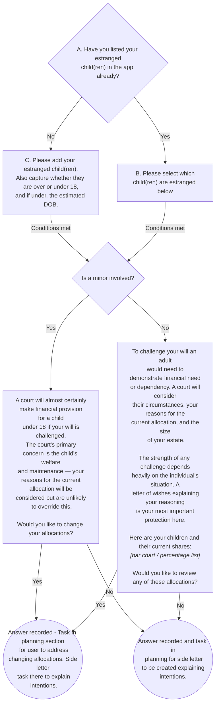
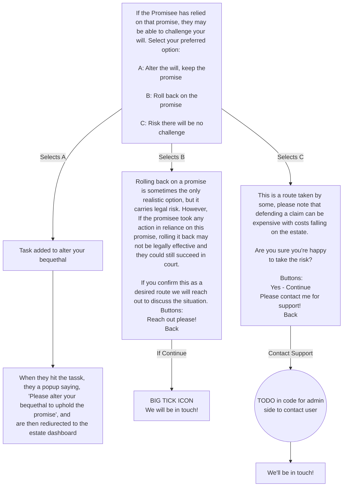

# Question 1 — Estranged child

If YES, immediately branch into two separate follow-ups because these are legally distinct situations:

Flow

# Question 2 — Promise contradiction

If YES, two follow-ups:

# Question 3 — Family conflict

If YES → no sub-questions needed. This is a severity amplifier, not a standalone data collector.
--> BUT need to add a task int he planning section of user's interface for side letter - for now TODO - "add planning letter to planning section"

All executors are beneficiaries → already detected from your data model → conflict flag makes this critical rather than advisory

The one genuinely useful optional follow-up is:

# Questions 4 & 5 — Disabled / vulnerable beneficiary

4b. For each identified person: "Is [name] currently receiving means-tested benefits?" (Yes / No / Not sure)

- YES or Not sure, flag for manual review.

This is the critical trigger. An outright inheritance above ~£16,000 disqualifies them from Universal Credit and similar benefits
Data needed: Person.means_tested_benefits (boolean)
Why it matters for the trigger: Person.is_disabled = TRUE AND Person.means_tested_benefits = TRUE THEN: Flag for manual review and let user know we'll be in touch

